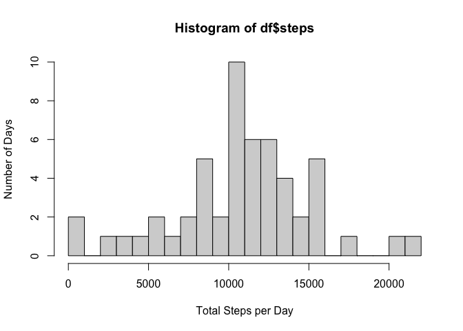
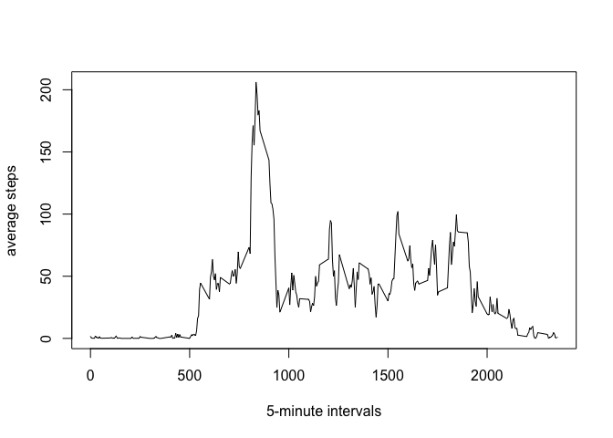
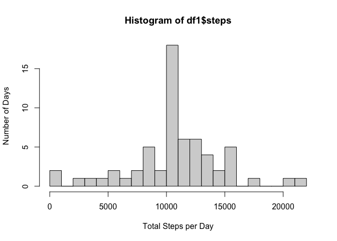
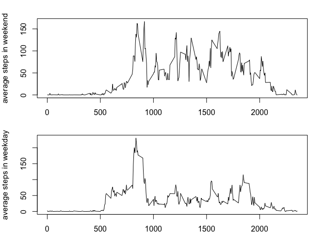

## Loading and preprocessing the data

Loading the data and then converting the date column into Date class


``` r
step_data <- read.csv("activity.csv")
step_data$date <- as.Date(step_data$date,format = "%Y-%m-%d")
```

## What is mean total number of steps taken per day?

Evaluating the steps taken in each day 


``` r
steps_by_date<-tapply(step_data$steps, step_data$date, sum)
```

Now we are going to make a histogram of total number steps taken each day but before doing so we first going to convert this array into a data frame


``` r
df <- data.frame(dates=names(steps_by_date),steps=as.numeric(steps_by_date))
hist(df$steps,breaks=20,xlab = "Total Steps per Day",ylab = "Number of Days")
```

<!-- -->

Now the mean and median of the total number of steps taken per day is given as


``` r
mean(df$steps, na.rm =TRUE)
```

```
## [1] 10766.19
```

``` r
median(df$steps,na.rm = TRUE)
```

```
## [1] 10765
```


## What is the average daily activity pattern?

First we will see the number of average steps taken in each interval


``` r
avg_step_by_interval <- tapply(step_data$steps,step_data$interval,mean,na.rm=TRUE)
```

Now we are going to make a time series plot out of this


``` r
plot(names(avg_step_by_interval),avg_step_by_interval,
     type="l",
     xlab="5-minute intervals",
     ylab="average steps")
```

<!-- -->

Now we want to find the interval with maximum average of steps


``` r
which.max(avg_step_by_interval)
```

```
## 835 
## 104
```

This means that the interval 835 has the maximum average with the index 104 and to see what that maximum is we run


``` r
avg_step_by_interval[104][[1]]
```

```
## [1] 206.1698
```

## Imputing missing values

Now we will calculate the number of NA's in our table. But first realize that all NA's occur on the fir coulumn. 


``` r
sum(is.na(step_data$steps))
```

```
## [1] 2304
```

I realize that most of the NA's occur for every interval in a day. In other words for some days steps are completely NA for each interval. That's why I will fill up the NA's using the average of steps taken in each of those intervals. 


``` r
filled_copy <- step_data
for (i in 1:length(filled_copy$steps)){
    if (is.na(filled_copy$steps[i])) {
        interval <- filled_copy$interval[i]
        filled_copy$steps[i] <-   avg_step_by_interval[as.character(interval)][[1]]
    }
}
```

Now we are going to do the same steps we did on question 1 to this new filled data, i.e. we will plot histogram, evaluate mean and median. Hence, the histogram is


``` r
steps_by_date1<-tapply(filled_copy$steps, filled_copy$date, sum)
df1 <- data.frame(dates=names(steps_by_date1),steps=as.numeric(steps_by_date1))
hist(df1$steps,breaks=20,xlab = "Total Steps per Day",ylab = "Number of Days")
```

<!-- -->

And the mean and median are


``` r
mean(df1$steps)
```

```
## [1] 10766.19
```

``` r
median(df1$steps)
```

```
## [1] 10766.19
```

So we see that the results obtained here are pretty similar to the original data. Meaning that we did a good job while imputting the new values. 

## Are there differences in activity patterns between weekdays and weekends?

We will first create a new column which is composed of two character, namely "weekend" and "weekday", corresponding to the date.


``` r
days <- weekdays(filled_copy$date)
filled_copy <- cbind(filled_copy,days)
for (i in 1:length(filled_copy$days)){
    if (filled_copy$days[i] %in% c("Saturday","Sunday")){
        filled_copy$days[i] <- "weekend"
    } else {
        filled_copy$days[i] <- "weekday"
    }
}
```

Now we will split this into two smaller tables which includes only weekdays and weekends separately.


``` r
weekend_table <- filled_copy[filled_copy$days=="weekend",]
weekday_table <- filled_copy[filled_copy$days=="weekday",]
```

And now plotting 


``` r
avg_step_by_interval_weekday <- tapply(weekday_table$steps,weekday_table$interval,mean)
avg_step_by_interval_weekend <- tapply(weekend_table$steps,weekend_table$interval,mean)
par(mfrow = c(2,1), mar = c(2,4,2,2))
plot(names(avg_step_by_interval_weekend),avg_step_by_interval_weekend,
      type="l",
      xlab="5-minute intervals",
      ylab="average steps in weekend")
plot(names(avg_step_by_interval_weekday),avg_step_by_interval_weekday,
      type="l",
      xlab="5-minute intervals",
      ylab="average steps in weekday")
```

<!-- -->


